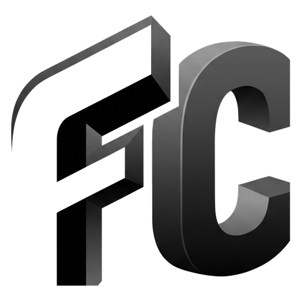

<div align="center">



# FrameCast Studio

**Ultra-lightweight, zero-copy screen recording & live streaming for Windows**  
**Capture d'écran, enregistrement et streaming zéro-copie ultra-optimisés pour Windows**

[](https://github.com/ArizakiDev/FrameCast-Studio/releases/latest)
[](https://github.com/ArizakiDev/FrameCast-Studio)
[](LICENSE)
[](https://dotnet.microsoft.com/)

[🇫🇷 Français](#-français) • [🇬🇧 English](#-english)

</div>

---

## 🇫🇷 Français

### Présentation

**FrameCast Studio** est conçu pour être l'outil d'enregistrement et de streaming le plus léger et rapide sur Windows. Contrairement aux solutions lourdes et généralistes, FrameCast Studio utilise un **pipeline matériel direct et zéro-copie** entre Windows Graphics Capture, Direct3D 11 et l'encodeur de votre carte graphique (NVENC / AMF / Intel QSV), garantissant un impact FPS imperceptible en jeu et une consommation mémoire minime.

---

### ⚡ Performances & Optimisations Extrêmes

| Métrique | Logiciels classiques (OBS, etc.) | **FrameCast Studio** |
|---|---|---|
| **Chemin vidéo** | Copies CPU ↔ GPU multiples | **100% VRAM (Zero-Copy)** |
| **Utilisation CPU** | 5% à 15%+ | **< 1% (entièrement déporté GPU)** |
| **Empreinte RAM** | 300 Mo à 1 Go+ | **~70 Mo à 120 Mo** |
| **Conversions de format** | Shaders complexes ou passes CPU | **Hardware VideoProcessor Blt direct** |
| **Allocations mémoire (GC)** | Fréquentes par frame | **0 allocation par frame** (Pools & Spans) |
| **Temps de démarrage** | 3 à 8 secondes | **< 0.5 seconde** |

#### 🔬 Architecture sous le capot
1. **Pipeline Zéro-Copie GPU pur** :
   $$\text{WGC (VRAM)} \xrightarrow{\text{VideoProcessorBlt}} \text{Texture NV12 (GPU)} \xrightarrow{\text{MF DXGI Surface}} \text{Encodeur Matériel}$$
   Les pixels ne transitent **jamais par la mémoire centrale (RAM)** ni par le bus PCIe. Seul le flux compressé final (~0.5 - 2 Mo/s) est écrit sur disque ou envoyé au réseau.
2. **Zero-Allocation dans la boucle critique** :
   - Pool fixe de textures NV12 pré-allouées (aucune allocation D3D par frame).
   - Utilisation intensive de `Span<T>`, `stackalloc` et `ArrayPool<byte>` pour le multiplexage FLV/RTMP.
3. **Mixage Audio vectorisé en SIMD** :
   - Mixage, filtres passe-haut, noise gate, compresseur et limiteur accélérés par instructions vectorielles AVX2 / `Vector<T>`.
4. **Capture multi-GPU intelligente** :
   - Détection automatique de l'adaptateur de l'encodeur matériel (`IDXGIFactory6`) sur PC portables pour éliminer les copies inter-GPU.

---

### ✨ Fonctionnalités

- **Enregistrement haute performance** — MP4 (H.264 / HEVC / AV1) avec support MP4 fragmenté (résistant aux crashs).
- **Streaming en direct à faible latence** — Muxer RTMP/RTMPS interne ultra-rapide pour Twitch, YouTube, Kick.
- **Mélangeur par application** — Ajustez le volume ou coupez le son de n'importe quelle application Windows en direct.
- **Suite DSP audio complète** — Gain, noise gate, compresseur dynamique, ducking automatique, limiteur anti-saturation et retour casque.
- **Capture d'écran instantanée** — Sans freeze ni lag bureau, enregistrement PNG/JPEG/BMP et copie presse-papiers.
- **Aperçu adaptatif** — S'ajuste dynamiquement à toute taille d'écran (1080p, 1440p, 4K, 32"+) avec option de désactivation pour économiser le GPU.
- **Discord Rich Presence** — Affiche votre statut d'activité en temps réel sur Discord (désactivable).
- **Mises à jour automatiques transparentes** — Intégrées via GitHub Releases avec contrôle d'intégrité SHA-256.

---

### 🖥️ Configuration requise

| | Minimum | Recommandé |
|---|---|---|
| **OS** | Windows 10 21H2 (build 19044) | Windows 11 |
| **GPU** | Compatible Direct3D 11 (Feature Level 11_0) | NVIDIA GeForce (NVENC) / AMD Radeon (AMF) / Intel Arc (QSV) |
| **RAM** | 2 Go | 4 Go+ |
| **Stockage** | ~80 Mo | — |

---

### 🚀 Installation & Lancement

1. Téléchargez l'archive `.zip` depuis la [dernière version](https://github.com/ArizakiDev/FrameCast-Studio/releases/latest).
2. Décompressez où vous le souhaitez.
3. Lancez `FrameCastStudio.exe` (aucun runtime externe requis).

---

### 🔨 Compiler depuis les sources

**Prérequis :** [.NET 10 SDK](https://dotnet.microsoft.com/download), Windows 10/11.

```bat
git clone https://github.com/ArizakiDev/FrameCast-Studio.git
cd FrameCast-Studio
build.bat
```

Pour générer un package de distribution optimisé :
```bat
publish.bat       # Version x64
publish-arm64.bat # Version ARM64
```

---

## 🇬🇧 English

### Overview

**FrameCast Studio** is engineered to be the most responsive, lightweight, and hardware-efficient screen recorder and live streaming client on Windows. By eliminating legacy layers, FrameCast Studio implements a **direct zero-copy hardware pipeline** uniting Windows Graphics Capture, Direct3D 11, and hardware encoders (NVENC / AMF / Intel QSV) for virtually 0% in-game FPS drop.

---

### ⚡ Extreme Optimizations & Benchmark

| Metric | Traditional Apps (OBS, etc.) | **FrameCast Studio** |
|---|---|---|
| **Video Pipeline** | Multiple CPU ↔ GPU copies | **100% VRAM Zero-Copy** |
| **CPU Usage** | 5% to 15%+ | **< 1% (Fully offloaded to GPU)** |
| **RAM Footprint** | 300 MB to 1 GB+ | **~70 MB to 120 MB** |
| **Color Conversion** | Complex shaders / CPU passes | **Hardware VideoProcessor Blt** |
| **GC Allocations** | Frequent per-frame allocations | **0 allocations per frame** (Pools & Spans) |
| **Startup Time** | 3 to 8 seconds | **< 0.5 second** |

#### 🔬 Engine Architecture
1. **Pure GPU Zero-Copy Path**:
   $$\text{WGC (VRAM)} \xrightarrow{\text{VideoProcessorBlt}} \text{NV12 Texture (GPU)} \xrightarrow{\text{MF DXGI Surface}} \text{Hardware MFT}$$
   Raw video frames never touch system RAM or PCIe bus transfers. Only final encoded packets (~0.5 - 2 MB/s) reach RAM.
2. **Zero-Allocation Hot Path**:
   - Pre-allocated pool of NV12 textures avoiding runtime D3D reallocations.
   - Comprehensive usage of `Span<T>`, `stackalloc`, and `ArrayPool<byte>` across FLV and RTMP muxing.
3. **SIMD-Accelerated Audio Engine**:
   - Audio mixing, high-pass filtering, noise gating, dynamic compression, and limiting are vectorized via AVX2 / `Vector<T>`.
4. **Smart Multi-GPU Selection**:
   - Matches the DXGI adapter to the hardware encoder on dual-GPU laptops to eliminate hidden PCIe inter-adapter blits.

---

### ✨ Features

- **Ultra-Efficient Recording** — MP4 (H.264 / HEVC / AV1) with crash-resilient fragmented MP4 option.
- **Low-Latency Streaming** — Custom lightweight RTMP/RTMPS muxer for Twitch, YouTube, and Kick.
- **Per-Application Audio Mixer** — Adjust volume levels or mute specific Windows apps on the fly.
- **Full Audio DSP Suite** — Gain, noise gate, compressor, sidechain ducking, limiter, and audio monitoring.
- **Zero-Lag Screenshot Capture** — Background staging map with automatic clipboard integration.
- **Adaptive Viewport** — Uniform scaling for any monitor size (including 32", 4K, ultrawide) with GPU-saving preview toggle.
- **Discord Rich Presence** — Displays real-time recording/streaming activity on Discord.
- **Built-in Auto-Updater** — One-click updates powered by GitHub Releases with SHA-256 validation.

---

### 🛠️ Tech Stack

| Component | Technology |
|---|---|
| UI Framework | WinUI 3 · Windows App SDK · .NET 10 |
| Screen Capture | Windows Graphics Capture (WGC) · FreeThreaded |
| Video Processing | Direct3D 11 · VideoProcessorBlt |
| Video Encoding | Hardware MFT via ICodecAPI (NVENC / AMF / QSV) |
| Audio Engine | WASAPI · SIMD Vectorization (`Vector<float>`) · NAudio |
| Streaming | RTMP/RTMPS · Zero-Alloc FLV Muxer |
| Updates | GitHub Releases API · SHA-256 verification |

---

### 📄 License

MIT License — © 2026 ArizakiDev. See [LICENSE](LICENSE) for details.

---

<div align="center">
Made with ⚡ by <a href="https://github.com/ArizakiDev">ArizakiDev</a>
</div>
